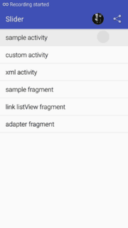

##[中文说明](https://github.com/KobeKomi/Slider/blob/master/README_CN.md)

DESCRIPTION
===================================
1.Slider purpose is to make the activity, fragment, view with sliding function <br />  
2.Slider in this version by simply extends or xml layout or added to by SliderUtils class with sliding function<br/>  



## USAGE

1.Currently supported Activity, Fragment, View.<br />  

2.By following simple operation, it may have a sliding function.

by SliderUtils.attach*

```java
public class SampleActivity extends Activity
{
    @Override
    protected void onCreate(Bundle savedInstanceState) {
        super.onCreate(savedInstanceState);
        setContentView(R.layout.activity_slider);
        SliderUtils.attachActivity(this, mConfig);
    }
}
```

or by extends:

```java
public class ExtendsActivity extends SliderActivity {
}
```
or by xml:
```xml
    <com.komi.slider.Slider
        xmlns:android="http://schemas.android.com/apk/res/android"
        xmlns:tools="http://schemas.android.com/tools"
        xmlns:slider="http://schemas.android.com/apk/res-auto"
        android:id="@+id/xml_slider_layout"
        android:layout_width="match_parent"
        android:layout_height="match_parent"
        slider:edgeOnly="false"
        slider:position="all">
        
     <TextView
        android:layout_width="wrap_content"
        android:layout_height="wrap_content"
        android:layout_gravity="center"
        android:text="I CAN SLIDE NOW!"
        android:textSize="23sp" />
        
        </com.komi.slider.Slider>
```


Note: activity of manifest need to override the configured theme: android: windowIsTranslucent, otherwise slide open the background is black.

```xml
 <style name="ActivityTheme" parent="Theme.AppCompat.Light.DarkActionBar">
        <item name="android:windowIsTranslucent">true</item>
    </style>
```
If the device is greater than the version of android L, you can use the following method instead:

```java
Utils.convertActivityToTranslucent activity)
```

If extends SliderFragment, you need to pay attention to is: SliderFragment  onCreateView function have been final overwritten, so another abstract methods to achieve creatingView and returns the layout of inflate objects.

```java
public class ExtendsFragment extends SliderFragment
{
    @Override
    public View creatingView(LayoutInflater inflater, ViewGroup container, Bundle savedInstanceState) {
        return inflater.inflate(R.layout.fragment_entends, container, false);
    }
}
```

or by SliderUtils
```java
public class SampleFragment extends Fragment 
{  
    private ISlider iSlider;
    private View rootView;
    
    @Override
    public View onCreateView(LayoutInflater inflater, ViewGroup container,
                             Bundle savedInstanceState) {
        rootView = inflater.inflate(R.layout.fragment_sample, container, false);
        iSlider=SliderUtils.attachFragment(this, rootView,null)
        return iSlider.getSliderView();
        }
}
```
or by xml...<br /> 
For more details, please refer to the code<br />  


### DEPENDENCIES

```java
dependencies{
    compile 'com.komi.slider:slider:0.2.0'
}
```

### ISSUES

1.Welcome to the Issues and refine the project, if you like, please click on the star, later will expand more useful features!<br /> 
2.This project extends from [SwipeBackLayout](https://github.com/ikew0ng/SwipeBackLayout) and [Slidr](https://github.com/r0adkll/Slidr)<br />  

## AUTHOR
 **[KobeKomi](https://github.com/KobeKomi)** 
